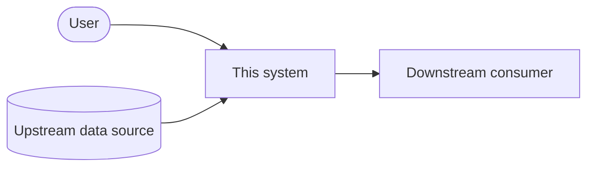

# System overview

> **Status:** placeholder. Replace each section below with the real system.
> Sections that stay empty should be deleted rather than left as headings —
> an outline of unanswered questions reads as documentation when it is not.

## Purpose

What the system does, in two or three sentences, for a reader who knows the
domain but not this codebase. Lead with the problem it solves, not the
technology it uses.

## Context

Who and what the system talks to — users, upstream services, downstream
consumers, third-party APIs. Everything outside the boundary belongs here.

## Components

The major internal pieces and what each is responsible for. Keep this to the
parts that a reader must know to navigate the code — a full inventory ages
badly and nobody reads it.

| Component | Responsibility | Notes |
| --------- | -------------- | ----- |
| | | |

## Data

The core entities, where they are stored, and who owns them. Note anything
with retention, residency, or privacy constraints — those are the details that
turn into incidents when they are undocumented.

## Key flows

Walk through the one or two paths that matter most, end to end. A request
lifecycle and the primary write path are usually the right choices.

## Constraints and non-goals

Hard limits the design must respect — latency budgets, compliance, scale
targets, systems that cannot be changed. Equally, what the system deliberately
does not do, so nobody rebuilds it into something it was never meant to be.

## Open questions

Known unknowns, with an owner where one exists. Move each into an ADR once it
is resolved.
